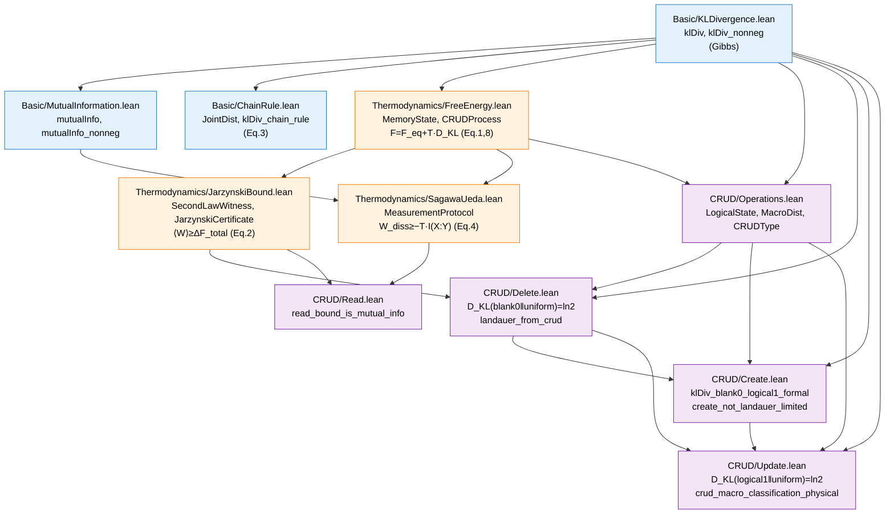
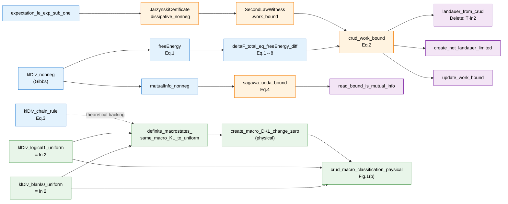

# CRUDThermo — Lean 4 Formalization Structure

> Formal verification of *"From Erasure to CRUD"* in Lean 4 / Mathlib.
> Files: 11 (`.lean`) across 3 layers.

---

## 1. Module DAG (import dependencies)

**Layer breakdown**

| Layer | Module | Role |
|---|---|---|
| L0 | `Basic/KLDivergence` | KL divergence over finite distributions; Gibbs |
| L1 | `Basic/MutualInformation` | I(X;Y) := D_KL(p_{XY} ‖ p_X⊗p_Y) |
| L1 | `Basic/ChainRule` | Joint distribution + macro/intra decomposition |
| L1 | `Thermodynamics/FreeEnergy` | F[p;λ] = F_eq + T·D_KL; ΔF_total |
| L2 | `Thermodynamics/JarzynskiBound` | Jarzynski → second law → ⟨W⟩ ≥ ΔF_total |
| L2 | `Thermodynamics/SagawaUeda` | Measurement: W_diss ≥ −T·I(X:Y) |
| L2 | `CRUD/Operations` | LogicalState, MacroDist, CRUDType taxonomy |
| L3 | `CRUD/Delete` | Landauer: D_KL = ln 2 |
| L3 | `CRUD/Create` | Known→Known: convention-dependent identities + work-bound corollary |
| L4 | `CRUD/Update` | Overwrite + **physical macro classification** |
| L4 | `CRUD/Read` | Sagawa–Ueda specialization |

---

## 2. Main Theorems (paper-cited results)

### 2.1 Information-theoretic foundation (`Basic/`)

| Lean name | Statement | Paper ref |
|---|---|---|
| `klDiv_self` | `D_KL(p ‖ p) = 0` | — |
| **`klDiv_nonneg`** | `D_KL(p ‖ q) ≥ 0` (Gibbs) when `q` has full support | Eq.(1) foundation |
| **`klDiv_chain_rule`** | `D_KL(p ‖ q) = D_KL^macro + Σ_m p_m · D_KL(p(·|m) ‖ q(·|m))` | **Eq.(3)** — structural heart of CRUD |
| `mutualInfo_nonneg` | `I(X;Y) ≥ 0` | Foundation for Read |

### 2.2 Free-energy framework (`Thermodynamics/FreeEnergy`)

| Lean name | Statement | Paper ref |
|---|---|---|
| `MemoryState.freeEnergy` | `F[p;λ] := F_eq(λ) + T·D_KL(p ‖ π_λ)` | **Eq.(1)** |
| `freeEnergy_ge_eq` | `F[p;λ] ≥ F_eq(λ)` | — |
| `freeEnergy_eq_iff_eq` | `F = F_eq ⟺ p = π` | — |
| `CRUDProcess.deltaF_total` | `ΔF_total := ΔF_eq + T·ΔD_KL^full` | **Eq.(8)** |
| **`deltaF_total_eq_freeEnergy_diff`** | `ΔF_total = F[p_f;λ_f] − F[p_i;λ_i]` | Connects Eq.(1)↔(8) |

### 2.3 Work bounds (`Thermodynamics/JarzynskiBound`)

| Lean name | Statement | Paper ref |
|---|---|---|
| `expectation_le_exp_sub_one` | `E[X] ≤ E[exp X] − 1` (Jensen for exp) | Lemma |
| `JarzynskiCertificate.jarzynski_eq` | `E[exp(−(W−ΔF)/T)] = 1` (axiom-as-hypothesis) | Jarzynski |
| **`JarzynskiCertificate.dissipative_nonneg`** | Jarzynski + Jensen ⇒ `W_diss ≥ 0` | Derived |
| `SecondLawWitness.work_bound` | `ΔF_total ≤ ⟨W⟩` | Wraps the witness |
| **`ThermodynamicProtocol.crud_work_bound`** | `⟨W⟩ ≥ ΔF_total` | **Eq.(2)** — unified Landauer |
| `crud_work_bound_expanded` | `⟨W⟩ ≥ ΔF_eq + T·ΔD_KL^full` | Expanded form |
| `crud_bound_hamiltonian_cycle` | If `ΔF_eq=0`: `⟨W⟩ ≥ T·ΔD_KL^full` | Read context |
| `work_decomposition` | `⟨W⟩ = ΔF_total + W_diss` | Identity |

### 2.4 Measurement bound (`Thermodynamics/SagawaUeda`)

| Lean name | Statement | Paper ref |
|---|---|---|
| `PassiveMeasurementProtocol.mutInfo_nonneg` | `I(X;Y) ≥ 0` | — |
| **`sagawa_ueda_bound`** | `W_diss^read ≥ −T·I(X:Y)` | **Eq.(4)** |
| `read_work_eq_diss` | Cycle: `⟨W⟩ = W_diss` when `ΔF_eq=0` | — |

### 2.5 CRUD operation theorems — **physical statements** (`CRUD/`)

These are the **convention-independent** (genuine Gibbs) statements that should be cited in the paper.

| Lean name | Statement | Paper ref |
|---|---|---|
| `klDiv_blank0_uniform` | `D_KL(blank0 ‖ uniform) = ln 2` | Delete (Landauer) |
| `klDiv_logical1_uniform` | `D_KL(logical1 ‖ uniform) = ln 2` | Update |
| `definite_macrostates_same_macro_KL_to_uniform` | `D_KL(logical1‖unif) = D_KL(blank0‖unif)` | geometric fact |
| **`create_macro_DKL_change_zero`** | `ΔD_KL^macro(Create) := D_KL(logical1‖unif) − D_KL(blank0‖unif) = 0` | **physical Create classification** |
| **`landauer_from_crud`** | Delete: `T·ln 2 ≤ ⟨W⟩` | Landauer recovered |
| **`create_not_landauer_limited`** | Create with `ΔF_total=0`: `0 ≤ ⟨W⟩` | Sec. 5.3, ΔF=−0.0373 |
| `update_work_bound` | Update: `T·ln 2 ≤ ⟨W⟩` | Same Landauer scale |
| **`crud_macro_classification_physical`** | Delete=ln2 ∧ Update=ln2 ∧ Create=0 (all genuine Gibbs) | **Fig.1(b) / Table 1** ← preferred citation |
| **`read_bound_is_mutual_info`** | `−T·I(X:Y) ≤ W_diss^read` | Read = Sagawa–Ueda |
| `read_nontrivial` | Read cycle with `W_diss > 0`: `⟨W⟩ > 0` | — |

### 2.6 Convention-dependent identities (`CRUD/Create.lean`)

These statements depend on Mathlib's `Real.log 0 = 0` and `_/0 = 0` conventions, **not on Gibbs nonnegativity**. They are retained as computational lemmas only and **should not be cited as KL values in the paper**.

| Lean name | Statement | Status |
|---|---|---|
| `klDiv_blank0_logical1_formal` | `klDiv blank0 logical1 = 0` | ⚠ formal artifact (support mismatch; mathematical KL is +∞) |
| `klDiv_logical1_self` | `klDiv logical1 logical1 = 0` | ✓ trivial Gibbs value |
| `create_delete_contrast_formal` | `klDiv(blank0‖unif) − klDiv(blank0‖logical1) = ln 2` | ⚠ uses formal artifact |
| `crud_macro_classification` | Delete=ln2 ∧ Update=ln2 ∧ `klDiv(blank0‖logical1)=0` | ⚠ third conjunct is formal artifact; superseded by `crud_macro_classification_physical` |

**Rule of thumb**: if a name ends in `_formal`, or its docstring explicitly mentions `Real.log 0 = 0`, it is a convention-dependent identity and should not appear in the physics narrative.

---

## 3. Key data structures

| Lean name | Type | Purpose |
|---|---|---|
| `FinDist Ω` | `structure` | Probability distribution on a `Fintype` |
| `JointDist M Ω` | `structure` | Joint with macro label `m` and micro state `x` |
| `MemoryState Ω` | `structure` | `(p, π, F_eq, T)` — physical state at param λ |
| `CRUDProcess Ω` | `structure` | Initial/final memory states (isothermal) |
| `LogicalState` | `inductive` | `L \| R` (double-well memory) |
| `MacroDist` | `structure` | `(p_L, p_R)` with `uniform`/`blank0`/`logical1` |
| `CRUDType` | `inductive` | `Create \| Read \| Update \| Delete` |
| `SecondLawWitness` | `structure` | Packages `(ΔF_total, ⟨W⟩, W_diss, W_diss≥0)` |
| `ThermodynamicProtocol Ω` | `structure` | Process + work statistics |
| `JarzynskiCertificate` | `structure` | Trajectory ensemble certifying Jarzynski equality |
| `SecondLawProtocol Ω` | `structure` | Protocol + nonneg dissipation hypothesis |
| `MeasurementProtocol X Y` | `structure` | Read with system–meter coupling |
| `PassiveMeasurementProtocol X Y` | `structure` | Measurement protocol with `W_diss ≥ 0` baked in |

---

## 4. Theorem dependency flow (semantic)

Green nodes: physical macro-KL classification chain (all genuine Gibbs values, no convention dependence).

---

## 5. Paper equation ↔ Lean theorem map

| Paper | Lean theorem (recommended) | File |
|---|---|---|
| Eq.(1) | `MemoryState.freeEnergy` (def) | `FreeEnergy.lean` |
| Eq.(2) | `ThermodynamicProtocol.crud_work_bound` | `JarzynskiBound.lean` |
| Eq.(3) | `klDiv_chain_rule` | `Basic/ChainRule.lean` |
| Eq.(4) | `sagawa_ueda_bound` | `SagawaUeda.lean` |
| Eq.(8) | `CRUDProcess.deltaF_total` (def) + `deltaF_total_eq_freeEnergy_diff` | `FreeEnergy.lean` |
| Sec. 4–5 (Delete) | `landauer_from_crud` | `CRUD/Delete.lean` |
| Sec. 4–5 (Update) | `update_work_bound` | `CRUD/Update.lean` |
| Sec. 4–5.3 (Create, ΔF≈0) | `create_not_landauer_limited` + `create_macro_DKL_change_zero` | `CRUD/Create.lean` + `CRUD/Update.lean` |
| Sec. 4–5 (Read) | `read_bound_is_mutual_info` | `CRUD/Read.lean` |
| **Fig. 1(b) / Table 1** | **`crud_macro_classification_physical`** | `CRUD/Update.lean` |

---

## 6. Convention dependence — what is and isn't a Gibbs claim

The formalization carefully separates two kinds of equalities involving `klDiv`:

**Genuine Gibbs values.** Computed against full-support distributions (typically the uniform prior `MacroDist.uniform`). These satisfy the hypotheses of `klDiv_nonneg` and represent honest information-theoretic quantities. All physical claims in the paper rest on these.

**Convention-dependent identities** (suffix `_formal`). Computed between delta distributions on disjoint support. Mathematically the KL is `+∞` (or undefined under strict Gibbs hypothesis), but Mathlib's `Real.log 0 = 0` and `_ / 0 = 0` conventions cause the syntactic expression to evaluate to `0`. These are **not used** in any physical statement.

The classification of Create as "not Landauer-limited" is therefore established through the genuine-Gibbs route:

> `klDiv_blank0_uniform = klDiv_logical1_uniform = ln 2`
> `⇒ definite_macrostates_same_macro_KL_to_uniform`
> `⇒ create_macro_DKL_change_zero` (= ΔD_KL^macro(Create) = 0)
> `⇒ crud_macro_classification_physical` (Fig.1(b))

**Suggested footnote for the paper.** *In the Lean formalization, the macro-KL classification of Create is established through `create_macro_DKL_change_zero`, which derives `ΔD_KL^macro = D_KL(logical1‖uniform) − D_KL(blank0‖uniform) = 0` from genuine Gibbs values against the full-support uniform prior. The convention-dependent identity `klDiv_blank0_logical1_formal` is retained only as a computational lemma and is not invoked in any physical claim.*

---

## 7. Axioms / Hypotheses (what's assumed, not proved)

The formalization assumes the following as physical inputs (encoded as hypotheses in `structure` fields, not as global axioms):

1. **Jarzynski equality** — `JarzynskiCertificate.jarzynski_eq`: `E[exp(−(W−ΔF)/T)] = 1`. From this, `W_diss ≥ 0` is *derived* via Jensen for `exp` (`expectation_le_exp_sub_one`).
2. **Full support of `q`** — required for `klDiv_nonneg` (otherwise log diverges).
3. **Isothermal process** — `CRUDProcess.T_eq`: initial and final temperatures coincide.
4. **Hamiltonian cycle for Read** — `ΔF_eq = 0` for `crud_bound_hamiltonian_cycle` and `read_nontrivial`.

No `axiom` declarations are introduced. Everything else proceeds from Mathlib + the structure-field hypotheses.
